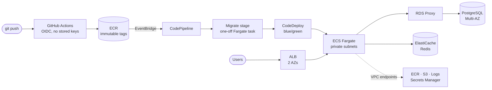

# Thierry Kwizera

### Backend & Cloud Engineer — I build Python services *and* the AWS infrastructure that ships them safely.

Python · Django · FastAPI · AWS (ECS, RDS, CloudFormation) · CI/CD · Test automation · LLM integration

📍 Kigali, Rwanda (CAT, UTC+2) · Open to remote contracts and full-time roles

<!-- Add LinkedIn here:
https://www.linkedin.com/in/thierry-kwizera-8179ba353/
-->

---

## 💡 What I bring to a team

- **Production experience with real money.** I built and operated the backend of a live multi-tenant booking marketplace, including payments with webhook verification, idempotency and reconciliation.
- **End-to-end delivery.** I write the Django or FastAPI service, containerise it, define its AWS infrastructure in CloudFormation, and build the pipeline that deploys it with zero-downtime blue/green releases.
- **Security by default.** No long-lived AWS keys in CI (GitHub OIDC), data tiers with no internet route, KMS encryption at rest, IAM roles scoped to a single repo and branch.
- **Tests are part of the build.** 320+ automated tests on my AI backend, 95% coverage on others, and lint plus tests gating every deploy. I have also worked as a QA engineer: test design, boundary value analysis, API testing.
- **I find the real cause.** When something breaks, I isolate it with controlled experiments instead of guessing. See the [Elastic Beanstalk write-up](#5-debugging-case-study-ci-deploys-failing-only-under-oidc) below.

---

## 🚀 Featured work

### 1. OriNest — multi-tenant booking marketplace, live in production
[orinestbooking.com](https://orinestbooking.com) ·

A Rwandan marketplace for stays, car rentals, attractions, events and a vendor store, with subscription plans, platform commission, and property and tenant management tools for hosts and businesses. I built the backend in **PHP** and ran it in production.

**Multi-tenancy from one codebase.** Hosts, agents, vendors and client organisations share one database. Every request resolves a tenant context first, and all data access is scoped by tenant in one place, so no individual query can leak another tenant's data.

Payments that survive the real world.** Payment providers retry callbacks, send them out of order, or never send them.

- **Webhook verification:** a callback isn't trusted until it's authenticated.
- **Idempotency:** a duplicate or retried callback can't double-confirm a booking or double-count a payment.
- **Reconciliation:** a scheduled job catches what webhooks missed, so the books always match the provider.
- **Platform revenue model:** commission splits and subscription-plan billing for hosts and vendors.

**Running it in production.** Linux + Nginx, Dockerised services, automated deployments, scheduled database backups and monitoring.

`PHP` `Multi-tenancy` `Payments & webhooks` `Nginx` `Docker` `Linux`

---

### 2. Production-grade container platform on AWS
[`md6-infra-repo`](https://github.com/thierry0011/md6-infra-repo) · [`md6-app-repo`](https://github.com/thierry0011/md6-app-repo) · [`Md6-bootstrap-repo`](https://github.com/thierry0011/Md6-bootstrap-repo)

The Django app is just the payload. The real work is the platform around it: highly available, private by default, and deployed entirely from git.

- **8 CloudFormation nested stacks** under one root (network, security, VPC endpoints, database, cache, ECS/ALB, autoscaling, CI/CD), deployed by GitHub Actions on every push.
- **Zero-downtime releases:** ECR push → EventBridge → CodePipeline → CodeDeploy blue/green. Each pipeline run is pinned to the exact image digest that was pushed.
- **Safe database migrations:** a dedicated pipeline stage runs `migrate` as a one-off Fargate task *before* traffic shifts, so a bad migration blocks the deploy instead of breaking a live cutover.
- **Private by design:** four subnet tiers across 2 AZs. The app can reach PostgreSQL only through **RDS Proxy**, enforced by chained security groups, and the data and cache tiers have no internet route at all.
- **No NAT Gateway:** ECR, S3, CloudWatch Logs and Secrets Manager are reached through VPC endpoints, which lowers both cost and attack surface.
- **Secrets & encryption:** credentials live in Secrets Manager and SSM, never in the image. One rotated KMS key encrypts RDS, Redis, logs and pipeline artifacts.
- **Redis read-through caching** with write invalidation, CPU-based autoscaling (1–4 tasks), plus a teardown script and runbook for clean spin-down and respin.

`AWS CloudFormation` `ECS Fargate` `CodePipeline` `CodeDeploy` `RDS Proxy` `ElastiCache` `KMS` `GitHub Actions` `Django` `uv`

---

### 3. [LibraryMind](https://github.com/thierry0011/LibraryMind) — AI-powered library assistant

A FastAPI backend with a layered architecture (API → services → AI providers → infrastructure), built so it keeps working when an AI vendor doesn't.

- **RAG pipeline:** semantic search over a ChromaDB vector store, relevance filtering, and cited sources in every answer.
- **Multi-provider AI layer:** OpenAI and Anthropic behind one interface, with retry/backoff and automatic failover.
- **Conversational memory:** multi-turn chat with context-window-aware history truncation.
- **Structured outputs:** ticket classification and review summarisation with JSON validation.
- **Production concerns:** Redis caching, a thread-safe token-bucket rate limiter, and per-call token and cost tracking.
- **320+ automated tests** that never call a live API, run in CI with Ruff lint and format checks on Python 3.11 and 3.12.

`Python` `FastAPI` `ChromaDB` `Redis` `OpenAI` `Anthropic API` `pytest` `GitHub Actions`

---

### 4. Photo gallery on ECS with S3 + CloudFront
[`md5-photo-uploader-infra`](https://github.com/thierry0011/md5-photo-uploader-infra) · [`md5-photo-uploader-app`](https://github.com/thierry0011/md5-photo-uploader-app)

- Uploads go to a private, KMS-encrypted S3 bucket and are served through **CloudFront with Origin Access Control**. Metadata lives in PostgreSQL.
- **flake8 and pytest run as a Docker build stage:** if a test fails, no image is built and nothing deploys.
- Same blue/green pattern as above, documented with four **diagram-as-code** flows (architecture, app push, infra push, user upload).

---

### 5. Debugging case study: CI deploys failing only under OIDC
[`md3-beanstalk-lab-amalitech`](https://github.com/thierry0011/md3-beanstalk-lab-amalitech)

Elastic Beanstalk's `UpdateEnvironment` call kept failing from CI even though the IAM permissions were correct. I ran the same call with **identical permissions under three credential types**: an OIDC role, a plain `AssumeRole` session, and a static IAM user. Only the static user succeeded.

That ruled out IAM scoping and isolated the cause: STS session tokens weren't carried through Beanstalk's S3 hand-off for oversized templates.

**Fix:** CI creates a short-lived access key for a single-purpose IAM user, uses it for that one call, and deletes it in the same job. GitHub still stores no AWS credentials.

---

## 📂 More projects

| Project | What it shows |
|---|---|
| [secure_vpc_cloudformation_deployment_lab](https://github.com/thierry0011/secure_vpc_cloudformation_deployment_lab) | Multi-AZ VPC with one NAT Gateway per AZ, security-group-to-security-group rules, SSM-only access (no SSH), deployed via CloudFormation Git sync |
| [Md3_auto_scaling_lab](https://github.com/thierry0011/Md3_auto_scaling_lab) | ALB + EC2 Auto Scaling in private subnets; step scaling with separate scale-out and scale-in thresholds to prevent flapping |
| [md4-EcsCiLab-infra_repo](https://github.com/thierry0011/md4-EcsCiLab-infra_repo) | First ECS blue/green pipeline: 6 stacks, plus a script that redeploys stacks that depend on a changed one |
| [md4-Push-Docker-Image-to-ECR](https://github.com/thierry0011/md4-Push-Docker-Image-to-ECR) | Hardened non-root image pushed to ECR via OIDC, with image scanning and a lifecycle policy |
| [Agile_devops_practices](https://github.com/thierry0011/Agile_devops_practices) | Two-sprint Agile delivery with TDD: 177 tests, 95% coverage, GitHub Actions CI |
| [iam-automation-lab](https://github.com/thierry0011/iam-automation-lab) · [iam-permission-testing](https://github.com/thierry0011/iam-permission-testing) | IAM as code and least-privilege permission validation |
| [amalitech-data-governance](https://github.com/thierry0011/amalitech-data-governance) | Data governance review of a lending product: data-flow diagram, review card, process essay |

---

## 🧰 Tech stack

  

| Area | Tools |
|---|---|
| **Backend** | Python, PHP, Django / DRF, FastAPI, Flask, REST & GraphQL APIs, multi-tenant design, payment-gateway integration |
| **Cloud** | AWS ECS Fargate, ALB, RDS + RDS Proxy, ElastiCache, S3, CloudFront, VPC & endpoints, IAM, KMS, Secrets Manager, Elastic Beanstalk, EC2 Auto Scaling |
| **Ops** | Linux, Nginx, Docker, automated deploys, backups & monitoring |
| **IaC & CI/CD** | CloudFormation (nested stacks, Git sync), GitHub Actions with OIDC, CodePipeline, CodeBuild, CodeDeploy blue/green, Docker |
| **AI engineering** | RAG pipelines, ChromaDB, OpenAI & Anthropic APIs, provider failover, prompt engineering, structured outputs |
| **QA & testing** | pytest / unittest, mocking, test case design, boundary value analysis, Postman, Jira / Xray |
| **Databases** | PostgreSQL, MySQL, Redis |

---

## 💼 Experience

**Software Development Apprentice — Backend, Cloud & QA** · AmaliTech
- Built Python services and deployed them on AWS ECS Fargate with CloudFormation and blue/green CI/CD pipelines.
- QA engineer on **RMS**, an HR and payroll platform: designed test cases for loan disbursement and payroll deduction logic, tested GraphQL APIs in Postman, applied boundary value analysis, and traced a proof-of-payment bug end to end.

**Backend Developer / Systems Administrator** · Origin Group Ltd ([orinestbooking.com](https://orinestbooking.com))
- Built the PHP backend of a **multi-tenant booking marketplace** serving hosts, vendors and client organisations from one codebase ([design overview](#1-orinest--multi-tenant-booking-marketplace-live-in-production)).
- Integrated **payment gateways** with webhook verification, idempotent transaction handling, scheduled reconciliation, and commission and subscription billing.
- Ran production: Linux + Nginx, Docker, automated deployments, backups and monitoring.

---

## 🎓 Certifications

- AWS Certified Cloud Practitioner
- Google Cybersecurity Professional Certificate
- Python Programming Specialization (Coursera)

---

## 📫 Let's work together

I'm a good fit if you need someone to:
- build or extend a **Python backend** (Django / FastAPI) with real tests behind it
- move an app onto **AWS with infrastructure as code** and automated, zero-downtime deploys
- add **LLM features** (search, Q&A, classification) that hold up in production
- strengthen **QA**: test plans, API test suites, and CI quality gates

📧 **[kwizerat21@gmail.com](mailto:kwizerat21@gmail.com)** · remote, or on-site in Kigali
